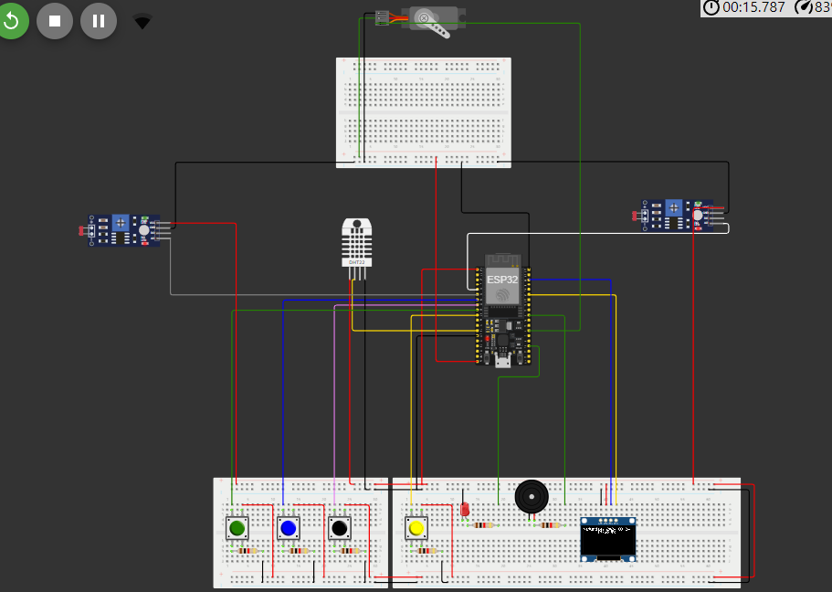
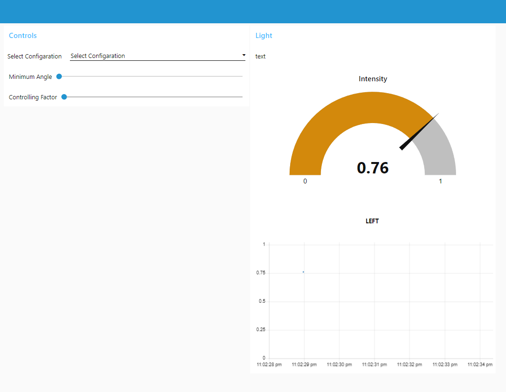

# Smart Medi-Box

## Overview

The Smart Medi-Box is an IoT-based project designed to remind users to take their medicines and monitor environmental conditions such as temperature and humidity. The system is powered by an ESP32 board and communicates with a monitoring system via MQTT, with real-time data visualization on a Node-RED dashboard.

## Project Features

- **Medicine Reminder:**
  - Push buttons allow users to acknowledge reminders, and LEDs provide visual indicators when it's time to take medication.
  
- **Environmental Monitoring:**
  - Two DHT22 sensors monitor the temperature and humidity levels inside the medi-box, ensuring that medicines are stored under appropriate conditions.

- **Node-RED Dashboard:**
  - The system's data is displayed on a Node-RED dashboard running on a computer. This dashboard provides real-time updates on environmental conditions and medicine reminders.

## Hardware Components

- **ESP32 Board:** Central processing unit that controls the sensors, buttons, and LEDs.
- **DHT22 Sensors:** Measure temperature and humidity levels inside the medi-box.
- **LDRs:** Measure light intensity
- **Push Buttons:** Used by the user to interact with the system, such as acknowledging reminders.
- **LEDs:** Indicate when it's time to take medication.
- **OLED-Display:** Display time and options.
- **Buzzer:** To use as alarm.
- **SERVO motor:** To adjest window angle.

## Software and Communication

- **Node-RED Dashboard:** Runs on a computer and visualizes the data received from the ESP32.
- **MQTT Protocol:** ESP32 uses Wi-Fi to communicate with the Node-RED dashboard via MQTT, sending sensor data and receiving control commands.

## Installation

1. **Hardware Setup:**
   - Connect the DHT22 sensors, push buttons, and LEDs to the ESP32 board as per the circuit diagram below.
  
     

2. **Software Setup:**
   - Install Node-RED on your computer and configure the MQTT broker. You may import flow.json to get the following dashboard.

     
     
   - Update the WiFi gateway details in sketch.ino and upload the Code using Arduino IDE.

3. **Running the System:**
   - Deploy the Node-RED dashboard.
   - Power up the ESP32 board to start monitoring and sending data to the dashboard.

## Usage

- **Medication Reminders:** Users will receive visual notifications via LEDs when it's time to take their medicines. The Node-RED dashboard will also display these reminders.
- **Environmental Monitoring:** The dashboard will continuously monitor and display the temperature and humidity levels, alerting users if they go out of the desired range.

